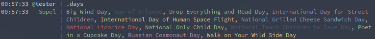

# Checkiday sopel plugin

A plugin that returns today's holidays from checkiday.com

## Installation

Can be installed from the pip using:

    pip install sopel_modules.checkiday

## Testing

If you would like to make a contribution, be sure to run the included tests. Test requirements can be installed using:

    pip install -r requirements_dev.txt

run tests using:

    make test

and start up a test sopel instance with docker by using:

    docker-compose up -d
    docker attach weechat
